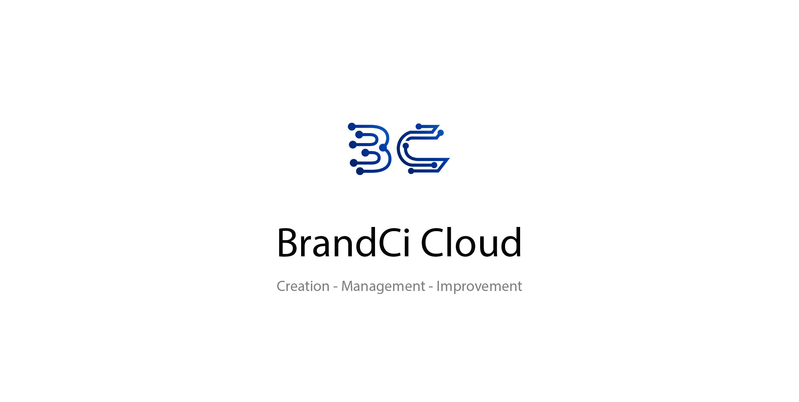

# BrandBookV2
 

**Creation - Management - Improvement**

BrandCi offers the opportunity to create, document and improve a comprehensive company brand in a continuous process.

Get a impression: [https://www.brandci.cloud](https://www.brandci.cloud)

**Project information / used technologies**
 - C# ASP.NET MVC5 + Entity Framework
 - Angular
 - MS SQL Server

**Experimentally used technologies**
 - ML.NET / AutoML for recognizing suitable color values

**DevOps**
 - GitHub as VersionControl
 - Azure DevOps for CI / CD Pipelines
 - Azure Web Services for the Application-Hosting
 - Docker-Swarm (Linux) to provide the MS SQL Server
